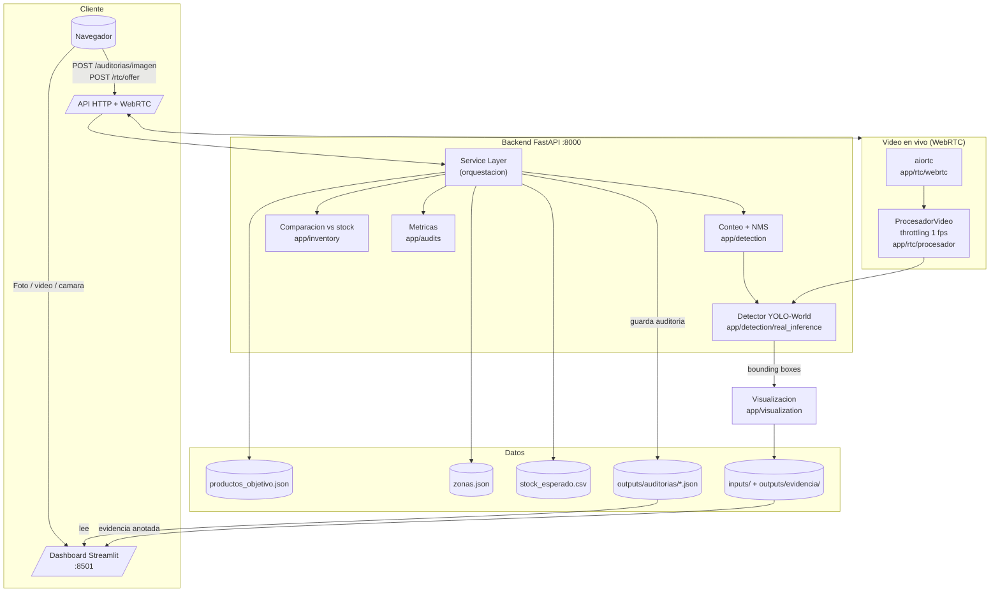
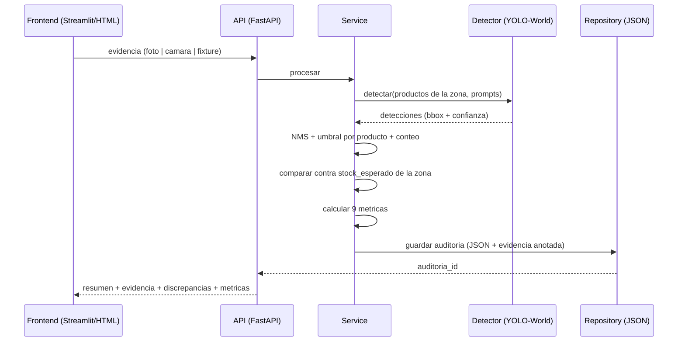

# Arquitectura — Auditoria Visual de Inventario (POC)

Documento de referencia visual y de decisiones para presentar el sistema ante el
jurado. Complementa el [Manual Tecnico](MANUAL_TECNICO.md).

---

## 1. Vista de componentes

## 2. Flujo de una auditoria (cualquier fuente)

## 3. Decisiones clave

| Decision | Por que |
| --- | --- |
| **Zero-shot (YOLO-World)** | No requiere dataset propio; se configura por prompts de texto. Permite agregar productos sin reentrenar. |
| **Modelo compartido + locks** | Un solo YOLO en memoria (~340 MB) para todas las conexiones; YOLO no es thread-safe → RLock serializa. |
| **Single source of truth en `data/`** | Productos, zonas y stock viven en JSON/CSV editables. Agregar producto/zona = editar datos, sin tocar codigo. |
| **Auditorias en JSON por archivo** | Simple, trazable, auditado por un humano en Git. Suficiente para POC; migrable a DB si escala. |
| **Throttling 1 fps en camara** | La inferencia en CPU es ~1 fps. Procesar 1 frame/s mantiene la demo fluida y baja la carga. |
| **WebRTC con aiortc (signaling HTTP)** | Sin servidor de signaling aparte: un endpoint POST intercambia SDP. Aditivo, no reemplaza el flujo de fotos. |
| **Flujo de fotos como respaldo** | La demo en vivo puede fallar (wifi, permisos, HTTPS). La carga manual de imagen siempre queda disponible. |

## 4. Camino de escalamiento (narrativa)

1. Hoy: un deposito, 5 zonas, 7 productos, una estacion de trabajo.
2. Proximo paso: N estaciones corriendo la misma app (cada una apunta a su repo de datos).
3. Escala: reemplazar el repositorio JSON por una base (PostgreSQL) y el modelo por una
   version optimizada (TensorRT / GPU) si la tasa de fotos crece.
4. Vista de negocio: el dashboard ejecutivo ya consolida ahorro, ROI y discrepancias;
   se puede extender a reportes por turno/sucursal.